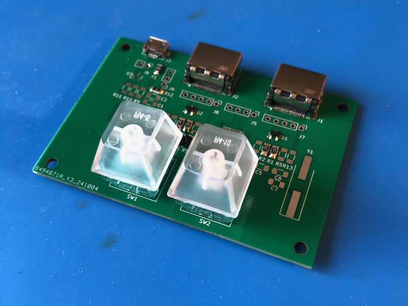

# Display Dimmer

A pair of physical buttons to control the brightness of a pair of external monitors over HDMI.

## Why?

My USB-C port replicator does not pass on brightness commands to my monitors.

## How?

HDMI has a control channel called DDC. Hook this board up to a spare HDMI port on a monitor and use the buttons to control the brightness.

# Hardware Considerations

Here are some design considerations that were taken into account.

## VCC Voltage

The board has a footprint for a 3.3 V regulator and also a footprint for a 0 Ohm bypass to use 5 V directly from USB. HDMI signaling is 5 V and the CH32V003 can run at 5 V, but both also work at 3.3 V. I have used the 5 V option.

## Pull-up Resistors

On my monitors, the I2C lines are already pulled up to 5 V internally. The PCB has footprints for additional pull-up, but I found it works fine without populating them.

## USB

The board has a USB connector for power. The data lines are connected to GPIO pins for possible future use.

> Only GPIOs 0-4 can be used for USB D+/D- due to limits of the [c.andi](https://msyksphinz-self.github.io/riscv-isadoc/html/rvc.html#c-andi) instruction which can only hold a 5 bit value.
> You **cannot use** PC5-PC7 and PD5-PD7 for D+/D-!

[GitHub - cnlohr/rv003usb: CH32V003 RISC-V Pure Software USB Controller](https://github.com/cnlohr/rv003usb)

## BOM

| Amount | Part                | Name         | Source                                                                  |
|--------|---------------------|--------------|-------------------------------------------------------------------------|
| 1x     | MCU                 | CH32V003F4P6 | WCH on Aliexpress                                                       |
| 2x     | HDMI connector      | 685119134923 | [Electrokit](https://www.electrokit.com/hdmi-hona-19p-pcb-smd-wrth)     |
| 1x     | Micro USB connector | 629105136821 | [Electrokit](https://www.electrokit.com/usb-micro-b-kontakt-smd)        |
| 2x     | Buttons             | MX-style     |                                                                         |
| 1x     | Fuse                | 1206L025YR   | [Electrokit](https://www.electrokit.com/polyswitch-16v-0.25a-smd)       |
| 4x     | Protection resistor | 1206 22R     |                                                                         |
| 2x     | ESD protection      | NUP2105LT1G  | [Electrokit](https://www.electrokit.com/nup2105lt1g-sot23-3-tvs-diod)   |
| 1x     | 5 V bypass          | 1206 0R      |                                                                         |

### Not mounted

| Amount | Part                | Name         | Source                                                                                    |
|--------|---------------------|--------------|-------------------------------------------------------------------------------------------|
| 4x     | Pull-up resistor    | 1206 10K     |                                                                                           |
| 1x     | 3.3 V LDO           | LDI1117-3.3H | [Electrokit](https://www.electrokit.com/ldi1117-3.3h-sot-223-spanningsregulator-ldo-3.3v) |
| 1x     | Crystal 24 MHz      | HC49/U4H     | [Electrokit](https://www.electrokit.com/kristall-24.000mhz-smd-hc49/u4h)                  |

# Firmware

There are three firmware options:

1. The proof-of-concept written in Micropython on a Raspberry Pi RP2040.
2. The prototype firmware written in Platformio/Arduino C++ on a WCH CH32V003 devkit.
3. The final firmware written in Rust on the custom PCB.

## DDC Commands

DDC commands are hard-coded in the firmware. The payloads were generated from a slightly modified version of [python-ddcci](https://github.com/Informatic/python-ddcci)

| Command       | Data                                          |
|---------------|-----------------------------------------------|
| Set 0%        | `[0x51, 0x84, 0x3, 0x10, 0x0, 0x0, 0xa8]`     |
| Set 10%       | `[0x51, 0x84, 0x3, 0x10, 0x0, 0xa, 0xa2]`     |
| Set 20%       | `[0x51, 0x84, 0x3, 0x10, 0x0, 0x14, 0xbc]`    |
| Set 30%       | `[0x51, 0x84, 0x3, 0x10, 0x0, 0x1e, 0xb6]`    |
| Set 40%       | `[0x51, 0x84, 0x3, 0x10, 0x0, 0x28, 0x80]`    |
| Set 50%       | `[0x51, 0x84, 0x3, 0x10, 0x0, 0x32, 0x9a]`    |
| Set 60%       | `[0x51, 0x84, 0x3, 0x10, 0x0, 0x3c, 0x94]`    |
| Set 70%       | `[0x51, 0x84, 0x3, 0x10, 0x0, 0x46, 0xee]`    |
| Set 80%       | `[0x51, 0x84, 0x3, 0x10, 0x0, 0x50, 0xf8]`    |
| Set 90%       | `[0x51, 0x84, 0x3, 0x10, 0x0, 0x5a, 0xf2]`    |
| Set 100%      | `[0x51, 0x84, 0x3, 0x10, 0x0, 0x64, 0xcc]`    |
| Get (not used)| `[0x51, 0x82, 0x1, 0x10, 0xad]`               |