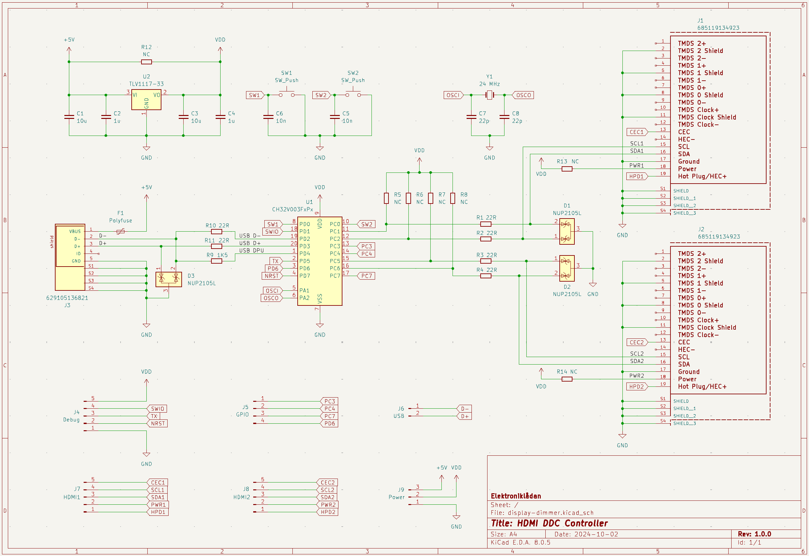

# Display Dimmer PCB

This folder contains the Kicad project files for the Display Dimmer PCB.

Unfortunatley, a couple of footprints from SnapEDA were used without realizing their license does not permit sharing. You will need to download them separatley:

- USB connector: https://www.digikey.se/en/models/2627271
- HDMI connector: https://www.digikey.se/en/models/2508506